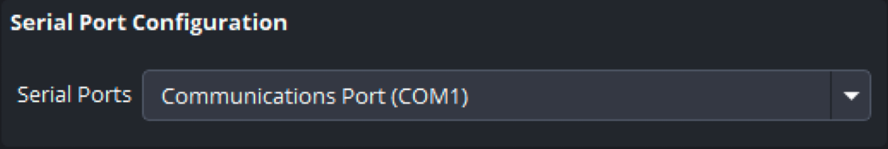

<h1>LTC in OBS</h1>

This is a plugin script written in python to use in the Open Broadcast Software (OBS). The main objective was to add the capture of an LTC signal through an audio input. However, other features were added which are summarized in the features section.

<h2>Table of contents</h2>

- [Features](#features)
- [Installation](#install)
- [Preparation](#preparation)
    - [Import the OBS profile](#import_profile)
    - [Import the OBS Scene](#import_scene)
    - [Import the script into OBS](#import_script)
- [Script configuration](#script_conf)
    - [LTC Configuration](#ltc_conf)
    - [Sources Configuration](#sources_conf)
    - [EDL Configuration](#edl_conf)
    - [Serial Port Configuration](#serial_cof)
    - [Miscellaneous Configuration](#misc_conf)
    - [Logging Configuration](#logging_conf)
- [Development and testing](#dev_test)
    - [Equipment](#equipment)
    - [Known Issues](#issues)
- [Motivation and aims for this project](#motivation)

<h2 id="features">Features</h2>

- Capture LTC through an audio input. Any analog input will do the work.
- Internal video switcher.
> Dynamically created OBS Hotkeys can be mapped to keyboard keys to act as a source switcher.

> Arduino serial I/O for switcher control. Arduino code and schematics included. Designed to use push buttons but can be adapted to GPIO interfaces.

- Start and stop recording controlled by the script.
- LTC can be displayed in a OBS Text source.
- Creates a EDL file with the cuts from the switcher.

<h2 id="install">Installation</h2>

Read [INSTALL.md](/INSTALL.md).

<h2 id="preparation">Preparation</h2>

Download or clone the repository to a location of your choice. We will refer to that location as **LTC-OBS** from now on.

<h3 id="import_profile">Import the OBS profile</h3>

1. In OBS menu goto **Profile** -> **Import**.  
1. Navigate to **LTC-OBS\obs_profile_scene** and select the folder **OBSLTC_Profile**.
1. Activate the profile in **Profile**.
1. Goto **File** -> **Settings** -> **Output** -> **Recording** and confirm the configuration. We use a **XDCAM MPEG2** like encoder encapsulated with a **MXF OP1A**.  

You can change the **File path or URL** folder destination at your taste.
Take in attention that the mxf file will be re-encapsulated using FFMpeg to add the correct start time code. 

<h3 id="import_scene">Import the OBS Scene</h3>

1. In OBS menu goto **Scene Collection** -> **Import**.
1. In a empty row press the **...** button of the **Collection Path** field.  

1. Navigate to **LTC-OBS\obs_profile_scene\Scene** and select the **OBS-LTC_scene.json** file.
1. Confirm that the row is checked (left side check box) and press **Import**.
1. Activate the scene in **Scene Collection**.

A **Missing Files** alert dialog may appear, you can press **Cancel**.   

The scene have the following aspect:  

<h3 id="import_script">Import the script into OBS</h3>

1. In OBS goto **Tools** -> **Scripts**.  
1. In the **Scripts** tab press the plus (**+**) sign button.   
1. Navigate to the **LTC-OBS** folder and  choose the **ltc-obs.py** script file.   

<h2 id="script_conf">Script configuration</h2>
<h3 id="ltc_conf">LTC Configuration</h3>

This is where the LTC related configurations are made. The **LTC-OBS\testes\test_live_no_blocking.py** can be used to list de devices properties and help choosing the correct device and channel.

- **Audio device**: choose the audio device where the LTC signal is connected.
- **Channel**: choose the channel to use. The audio device must be chosen first.
- **FPS**: choose the frame rate of the incoming LTC signal.
- **Buffer Size**: the size of the buffer (data chunk) that is read from the audio stream in each iteration. If you experience tc display jumps you may want to increment this values. You may experience tc frame drops if the value is too high. The values are in bytes. The default is 24 bytes. Take in consideration that each tc message frame have 80 bits size.
- **TC display source**: the OBS text source used to display the TC. This source can be turn visible or not at your convenience pressing the "eye" icon.
- **Use Timeline TC**: this will use the **Timeline Start TC** as starting TC for the EDL cuts. This feature is highly experimental and it's under development. Try to avoid it.

After all the configuration was made, you can use the **Start LTC capture** button to run the LTC. You can also use the button to test if the audio device and channel configuration are correct.

***

<h3 id="sources_conf">Sources Configuration</h3>

- **Cut Sources**: the Cut Sources are the OBS sources that are used as video input channels, and they will be mapped to hotkeys. The sources entered here must have the same name as the OBS sources. For instance, if you have 3 sources, named CAM1, CAM2 and CAM3, you must enter this names in the Cut Sources list. The order is importante too, you must follow the order that you want the for the mapped hotkeys. For instance, if you want the source *CAM1* mapped to the key *1*, keep it in the top of the list.  
To add sources to the list use the plus sign button (**+**) and to remove it use the trash bin button. To change a source name use the definition cogwheel button. After you have entered the sources names here, you must go to the OBS menu and navigate to **File** -> **Settings** -> **HotKeys** scroll down until you find the sources hotkeys and choose a key for each one.

 

- **Source for playout**: here you can choose the OBS source used for playout the recorded videos. If you are using the **OBS-LTC scene**, there is a source named **Playout** in the **PLAYOUT** scene, but you may want to use another one. The recorded videos are automatically opened in this source when a record action terminate.

***
<h3 id="edl_conf">EDL Configuration</h3>

- **Edl Format**: here you can choose the EDL format. There are 4 EDL format types by default (**file_16**, **file_32**, **file_129** and **CMX_3600**). You can add more formats in the ***edl_manager.py*** module using the ***output_formats*** dictionary.

- **EDL export folder**: here you can choose the folder where to export the EDL file. A good practice is to use the same folder where the video files are saved.

***
<h3 id="serial_cof">Serial Port Configuration</h3>

- **Serial Ports**: here you can choose the serial port for the Arduino switcher communication.

***
<h3 id="misc_conf">Miscellaneous Configuration</h3>

- **Apply Dock State**: if this box is checked, only the **Scenes**, **Sources** and **Audio Mixer** OBS Docks are loaded at the startup. The default for this box is checked. Take in mind that you must not use the Start Recording button in the Controls dock to control the recorder. Use the LTC-OBS button instead.

***
<h3 id="logging_conf">Logging Configuration</h3>

 

Each of this checkboxes activates the one log level. In production environment it's recommended to turn of at least the debug level.   

***

<h2 id="dev_test">Development and testing</h2>

Follows a brief description of the equipment used for development and the known issues.

<h3 id="equipment">Equipment</h3>

At the time I'm writing this markdown I'm using the following equipment:

- **Computer**: 
    - Dell Precision Tower 7910 with two Intel Xeon E5-2687W v3 @ 3.10GHz (10 cores each).
    - 128 GBytes of RAM
    - NVIDIA GeForce GTX 980 Ti
    - Windows 10 Professional

- **Video capturing**
    - Blackmagic Decklink Duo SDI
    - Blackmagic Decklink Studio 2

- **Signals generation and distribution**
    - Sony HVR-S270E HDV camera for SDI and LTC signals generation. 
    - The LTC signal comes from a BNC plug and is directly feeded into the Dell computer on-board audio microphone/LineIn 3.5 jack input using a splitter cable.
    - The SDI video signal is feeded into a Blackmagic SDI distributer and sended to the Decklinks inputs on the computer. To distinguish between channels in OBS, I use Color Correction filters in two of the inputs.

<h3 id="issues">Known Issues</h3>

- Timeline TC feature it's not working well. Some cuts does not coincide with the video changes. More work is needed in this feature.
- Some times the cuts made with the LTC delayed 1 frame. I notice that if I restart the OBS the problem goes away. Now are one callback for the hotkeys and another callback for the cam sources. The last one is triggered when the source comes visible and is where the running LTC is captured to be used in the cut. This may be refactored to save some processing time.
- I don't have done tests without the debug logging. Turning off the debug logging can save processing time printing to the stdout. This can be crucial to avoiding delays between the moment we press the key to change the source and the capture of the current running LTC frame. 

<h2 id="motivation">Motivation and aims for this project</h2>

The main goal when I started this project was to create a way to record signals from cameras like the Sony F55 and Sony Venice, while also capturing a video stream with the director's cuts from the video mixer (and generating the corresponding EDL for post-production), all while simultaneously recording on the cameras' memory cards (e.g., SxS Cards).  

By following a specific naming convention for OBS sources, it is theoretically possible to relink the media from the camera cards with the cuts stored in the EDL, provided that all equipment is using the same LTC signal. The video recorded in OBS can serve as a rough edit for the director, giving them an idea of the final cut, while the post-production team gains a better understanding of the director’s intentions.  

When cameras like the Sony Venice were introduced to the market with high-quality native codecs, recording to a video server became an undesirable workflow. Maintaining an expensive video server just to record a draft stream as an editing reference for post-production is not a cost-effective solution.  

The **LTC-OBS project** is an attempt to address this issue by integrating LTC into the OBS environment and, from there, developing a workflow that combines the advantages of video mixer cuts with the high-quality media recorded on digital camera cards.  

Unfortunately, I do not have the means to test this with multiple Sony F55 cameras using distributed LTC. However, the foundations have been laid. If anyone out there is interested in testing the script and workflow, please feel free to contact me.  

Rui Loureiro  
E-Mail: ruiloureiro70@gmail.com

